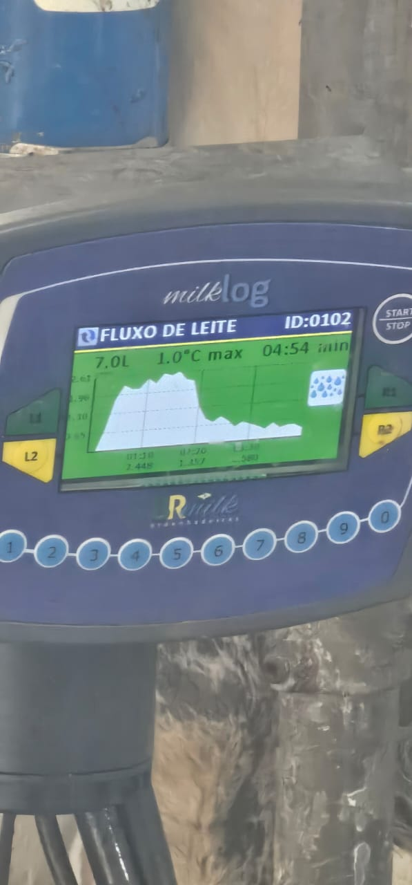

| Portao1  | Portao2 | LED |
| ------------- | ------------- |------------- |
| fechado  | fechado  |vermelho |
| movimento  | movimento  | Amarelo |
| aberto  | aberto  |Verde |

Você foi contratado pela prefeitura da cidade para ajudar a melhorar a segurança em uma rua próxima a uma escola.

Nessa rua existe uma faixa de pedestres, mas muitas vezes os carros passam ao mesmo tempo em que as pessoas tentam atravessar...4
